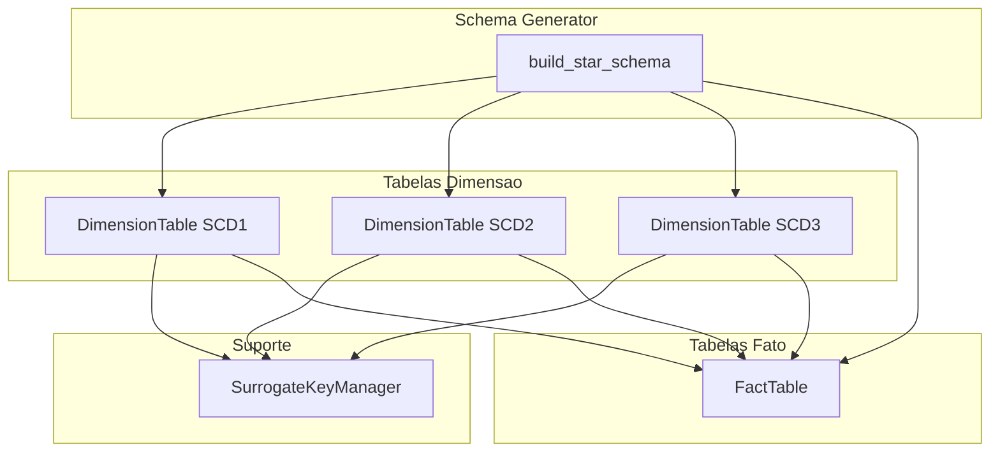
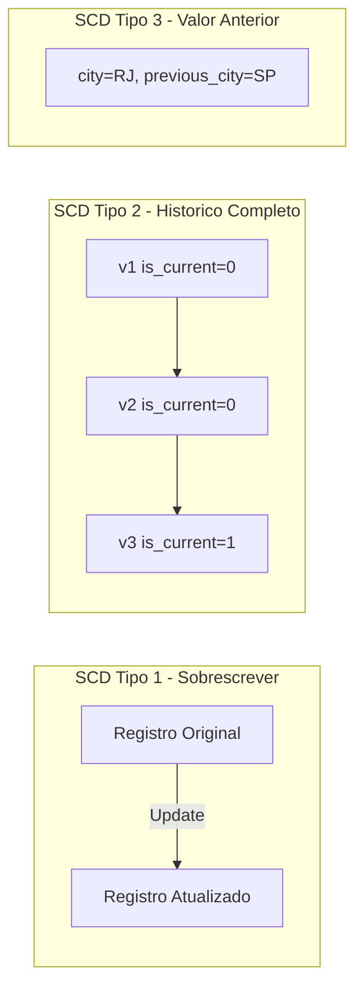

# Data Warehouse Dimensional Modeling


Toolkit de modelagem dimensional para Data Warehouses. Gerador de star/snowflake schema, tabelas de dimensao com SCD Types 1, 2 e 3, tabelas fato, gerenciamento de chaves substitutas e padroes ETL.

Dimensional modeling toolkit for Data Warehouses. Star/snowflake schema generator, dimension tables with SCD Types 1, 2 and 3, fact tables, surrogate key management, and ETL patterns.

---

## Arquitetura / Architecture



## SCD Types / Tipos SCD



## Funcionalidades / Features

| Funcionalidade / Feature | Descricao / Description |
|---|---|
| SCD Type 1 | Sobrescreve valores existentes / Overwrites existing values |
| SCD Type 2 | Historico completo com valid_from/valid_to / Full history with valid_from/valid_to |
| SCD Type 3 | Armazena valor anterior em colunas separadas / Stores previous value in separate columns |
| Surrogate Key Manager | Geracao e mapeamento de chaves substitutas / Surrogate key generation and mapping |
| Fact Table | Insercao unitaria e em massa, agregacao / Single and bulk insert, aggregation |
| Schema Generator | Construcao declarativa de star schemas / Declarative star schema construction |

## Inicio Rapido / Quick Start

```python
from src.dimensional_modeling import SchemaGenerator

gen = SchemaGenerator()
schema = gen.build_star_schema({
    "dimensions": [
        {"name": "dim_product", "columns": {"product_id": "TEXT", "name": "TEXT"},
         "natural_key": "product_id", "scd_type": 1},
        {"name": "dim_customer", "columns": {"customer_id": "TEXT", "city": "TEXT"},
         "natural_key": "customer_id", "scd_type": 2},
    ],
    "facts": [
        {"name": "fact_sales", "measures": {"revenue": "REAL", "qty": "INTEGER"},
         "dimension_keys": {"product_sk": "dim_product", "customer_sk": "dim_customer"}},
    ],
})

# Load dimensions
gen.dimensions["dim_product"].load({"product_id": "P1", "name": "Widget"})
gen.dimensions["dim_customer"].load({"customer_id": "C1", "city": "SP"}, "2024-01-01")

# Load facts
gen.facts["fact_sales"].insert({"product_sk": 1, "customer_sk": 1, "revenue": 150.0, "qty": 3})
```

## Testes / Tests

```bash
pytest tests/ -v
```

## Tecnologias / Technologies

- Python 3.9+
- SQLite3
- pytest

## Licenca / License

MIT License - veja [LICENSE](LICENSE) / see [LICENSE](LICENSE).
